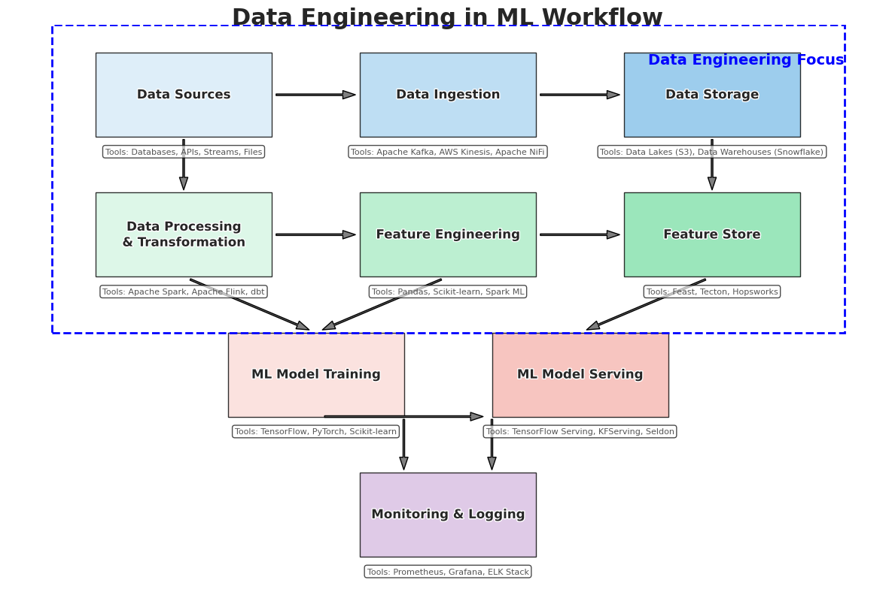

### Machine Learning Engineer Roadmap

This repository offers a hands-on, structured roadmap for machine learning engineers, data scientists, and software engineers to bridge the gap between machine learning theory and production-ready systems. By following this roadmap, you'll gain the skills and knowledge needed to deploy, monitor, and scale machine learning models in production, regardless of your background or experience level.

Over the last 5 years, machine learning engineering has evolved significantly. It's no longer just about training models, but also about deploying, monitoring, and scaling them in production. This shift has created a huge gap between machine learning theory and production-ready systems. 

#### Machine Learning Engineer Roadmap Overview

#### 1. Foundations of ML Engineering Role: 
This section lays the groundwork for understanding the critical components for ML engineers. It covers:

- **ML in Research vs Production:** Research often focuses on pushing the boundaries of accuracy—improving benchmarks by a few percentage points and publishing novel algorithms—while production is about reliability, scalability, and performance. In research, a paper might introduce a new algorithm that increases accuracy on a benchmark dataset by 2%, but in production, the goal is to deploy a model that not only performs well but also meets real-world constraints like low latency, high throughput, and optimized online metrics (e.g. conversion rate, click-through rate). For example, a research lab might work to achieve state-of-the-art results on datasets like ImageNet, whereas a company like Meta or TikTok would prioritize productionizing a model that delivers consistent performance, is easy to maintain, and adapts to changing data patterns—all while keeping the end-user experience smooth.

  Here are some resources that expand on this:
  - [Machine Learning Researcher vs Engineers – What's the Difference?](https://valohai.com/blog/machine-learning-researcher-vs-engineers-difference/) - This piece explores the technological gap between ML research and its application in production systems, emphasizing differences in objectives and methodologies.
  - [Academic Machine Learning Vs. Production Oriented Machine Learning](https://www.bairesdev.com/blog/academic-vs-production-oriented-ml/) - This article contrasts the goals and approaches of ML in academic research with those in business production environments, discussing factors like accuracy, speed, and practicality.
  - [What's the Difference between ML in Research vs in Production?](https://angelina-yang.medium.com/whats-the-difference-between-ml-in-research-vs-in-production-4cc7ab5678ec/) - This Medium article provides example questions and insights into the distinctions between ML research and production settings, particularly in interview contexts.
  - [Working in Research vs. Working in Production](https://huyenchip.com/ml-interviews-book/contents/1.1.1-working-in-research-vs.-workingin-production.html) - This section from "Machine Learning Interviews Book" examines the fundamental differences between ML in academic settings and in production, focusing on aspects like training versus serving and the pursuit of state-of-the-art results.
  - [What's the difference between machine learning researchers vs engineers?](https://www.qwak.com/post/whats-the-difference-between-machine-learning-researchers-vs-engineers?utm_source=chatgpt.com) - This article discusses the varying roles and focuses of ML researchers compared to engineers, particularly in terms of repeatability, record-keeping, and collaboration.

    **Which Way You Want to Go Depends on What You Really Love to Do**

    When choosing your career path in machine learning, let your passion be your guide. If you’re excited by the idea of breaking new ground in research—tweaking algorithms to squeeze out that extra percentage of accuracy and publishing your findings—then research might be your calling. On the other hand, if you thrive on solving real-world problems and enjoy the challenge of deploying scalable, robust models that directly impact user experiences, then production engineering is likely for you.
    
- **Data Engineering:** ## Data Engineering in the ML Engineer Roadmap

Data engineering is a critical pillar of machine learning (ML) engineering, bridging the gap between raw data and actionable ML models. For an ML engineer, data engineering isn’t just about moving data around—it’s about ensuring that high-quality, well-structured, and scalable data pipelines fuel robust ML systems. This section explores why data engineering is essential, key concepts, its role in the ML lifecycle, and free resources to get you started.

#### Why Data Engineering Matters for ML Engineers

Data is the lifeblood of ML models, and data engineering ensures it's accessible, reliable, and optimized for training, validation, and inference. Without solid data engineering practices, even the most sophisticated ML algorithms can fail due to poor data quality, scalability issues, or irreproducible results. Here's why it's a must-have skill:

#### 1. Data Quality
- **Why It Matters:** ML models are only as good as the data they’re trained on. Inconsistent, noisy, or incomplete data leads to unreliable predictions.
- **Example:** If an ETL pipeline accidentally includes future sales data in a training set for a demand forecasting model, the model will overfit and fail in production.
- **Data Engineering Role:** Cleaning, validating, and structuring data to eliminate biases, duplicates, or errors.

#### 2. Scalability
- **Why It Matters:** ML systems often process massive datasets—think terabytes of user logs or petabytes of video content. Efficient data handling is key to scaling these workloads.
- **Example:** Training a recommendation system for a platform like YouTube requires distributed processing of user interaction data using tools like Apache Spark.
- **Data Engineering Role:** Building pipelines that leverage distributed systems (e.g., Spark, Hadoop) or cloud-native services (e.g., AWS Glue, Google BigQuery).

#### 3. Feature Engineering
- **Why It Matters:** Features are the processed inputs that ML models use to make predictions. Consistent feature computation across training and inference is critical for model performance.
- **Example:** A real-time fraud detection system might rely on streaming pipelines to compute features like "average transaction amount over the last hour" from Kafka streams.
- **Data Engineering Role:** Designing and maintaining feature stores (e.g., Feast, Tecton) and real-time pipelines to serve features.

#### 4. Reproducibility
- **Why It Matters:** ML experiments must be repeatable for debugging, auditing, and compliance (e.g., GDPR, CCPA).
- **Example:** If a regulator asks how user data was processed for a credit scoring model, data lineage tracking can provide the answer.
- **Data Engineering Role:** Implementing data versioning and lineage tracking to document data origins and transformations.

#### Key Data Engineering Concepts for ML Workflows

Here’s a breakdown of essential data engineering concepts and their relevance to ML engineering, complete with practical examples:

| **Concept**            | **Role in ML Engineering**                                                                 | **Example**                                                                                   |
|-------------------------|--------------------------------------------------------------------------------------------|-----------------------------------------------------------------------------------------------|
| **Data Lakes**          | Store raw, unstructured, or semi-structured data (e.g., logs, images, videos) for exploratory analysis or ML experimentation. | Storing raw clickstream data in an AWS S3 bucket to later train a user behavior prediction model. |
| **Data Warehouses**     | House structured, query-optimized data for batch training or business intelligence (BI) reporting. | Using Snowflake to aggregate customer purchase history for a churn prediction model.          |
| **ETL/ELT Pipelines**   | Extract, transform, and load data into a format suitable for ML models, ensuring consistency and quality. | Transforming IoT sensor data (e.g., removing outliers) before loading it into a data lake for predictive maintenance. |
| **Apache Spark**        | Enable distributed processing of large datasets for feature engineering or model training. | Computing user embeddings from millions of social media posts for a sentiment analysis model. |
| **Streaming Pipelines** | Support real-time data ingestion and feature computation for low-latency ML inference.     | Using Apache Kafka and Flink to process live credit card transactions for fraud detection.    |

Data engineering underpins every stage of the ML lifecycle. Here’s how it integrates:

#### 1. Data Ingestion
- **What It Does:** Collects data from diverse sources—databases (e.g., MySQL), APIs (e.g., Twitter), or IoT devices—into a centralized repository.
- **Tools:** Apache Airflow (scheduling), AWS Kinesis (streaming), Apache NiFi (data flow automation).
- **ML Example:** Ingesting real-time user activity logs from a mobile app into a data lake for sentiment analysis.

#### 2. Feature Engineering
- **What It Does:** Transforms raw data into model-ready features (e.g., normalizing numerical data, encoding categorical variables, generating embeddings).
- **Tools:** Apache Spark (large-scale processing), Pandas (small-scale manipulation), DBT (data transformation workflows).
- **ML Example:** Converting raw text reviews into TF-IDF vectors for a text classification model.

#### 3. Training/Validation
- **What It Does:** Delivers clean, consistent features to ML frameworks for model training and evaluation.
- **Tools:** Feast (feature store for consistency), TFX (TensorFlow Extended for end-to-end pipelines).
- **ML Example:** Serving precomputed user features from a feature store to PyTorch for training a recommendation model.

#### 4. Inference
- **What It Does:** Ensures real-time or batch features are available for model predictions in production.
- **Tools:** Apache Kafka (streaming), AWS Lambda (serverless processing).
- **ML Example:** Streaming live stock market data through Kafka to compute features for a trading algorithm.

#### Getting Started: Free Resources for Data Engineering in ML

To build data engineering skills relevant to ML, explore these free resources from YouTube and blogs. They’re beginner-friendly yet practical for real-world ML workflows.

#### YouTube Courses
- [Fundamentals Of Data Engineering Masterclass](https://www.youtube.com/watch?v=hf2go3E2m8g&pp=ygU7RGF0YUNhbXAgRGF0YSBFbmdpbmVlcmluZyBGdW5kYW1lbnRhbHMgZm9yIG1hY2hpbmUgbGVhcm5pbmc%3D)
- [PySpark Tutorial](https://www.youtube.com/watch?v=_C8kWso4ne4)
- [What is Apache Kafka](https://www.youtube.com/watch?v=XFqm_ILuhs0&list=PLt1SIbA8guusxiHz9bveV-UHs_biWFegU)

#### Blogs
- [Data Engineering for Machine Learning by Towards Data Science](https://www.towardsdatascience.com/data-engineering-for-machine-learning-9b9b9b9b9b9b)
- [Building Data Pipelines with Apache Airflow](https://airflow.apache.org/docs/apache-airflow/stable/tutorial/pipeline.html)
- [Feature Stores 101: An Introduction for Beginners](https://domino.ai/blog/feature-stores-101-an-introduction-for-beginners)
- [Kafka with Spark Streaming —Different Approaches to Read Data](https://medium.com/plumbersofdatascience/kafka-with-spark-streaming-different-approaches-to-read-data-f38616c023b8)

#### Practical Tips for ML Engineers
- **Start Small:** Practice with a simple ETL pipeline using Pandas and SQLite before scaling to Spark or Airflow.
- **Leverage Cloud Tools:** Experiment with free tiers of AWS (e.g., S3, Glue) or Google Cloud (e.g., BigQuery) to understand cloud-native data engineering.
- **Focus on ML Needs:** Prioritize skills like streaming (for real-time inference) and feature engineering over traditional BI-focused data warehousing.
  
- **Model Lifecycle:** This encompasses stages like data collection and preparation, model training, evaluation, deployment, monitoring, retraining, and eventual retirement. Each stage has specific activities; for example, monitoring involves tracking performance metrics to detect model drift.
  Key things: Training, validation, deployment, retraining, and retirement.
  
- **Infrastructure Basics:** This includes virtualization (running multiple OS or apps on one server), containerization (packaging apps with dependencies, e.g., using Dockerfile), and orchestration (managing containers, e.g., with Kubernetes). These are essential for deploying models in production environments, ensuring scalability and portability.
  Key things: Virtualization, containerization, and orchestration.

Additionally, a notable inclusion is Soft Skills for ML Engineers, such as communication, collaboration, and project management, which are vital for working in cross-functional teams and managing stakeholder expectations.

#### 2. Model Building & Experimentation: 
This section focuses on the technical skills for creating and evaluating ML models, covering:

- **Algorithms:** Includes regression (predicting continuous values, e.g., house prices), classification (predicting categories, e.g., spam vs not spam), clustering (grouping similar data, e.g., customer segmentation), and deep learning (neural networks for complex patterns, e.g., CNNs for image recognition, RNNs for time series, Transformers for natural language processing).
- **Frameworks:**
  - Scikit-learn for traditional ML.
  - TensorFlow/PyTorch for deep learning.
  - XGBoost/LightGBM for gradient boosting.
- **Hyperparameter Tuning:** Hyperparameters are settings set before training (e.g., learning rate, number of layers) that affect model performance. Techniques include grid search (exhaustive search over parameter combinations), Bayesian optimization (more efficient, using probabilistic models), and tools like Optuna for automated tuning, which can save significant time in finding optimal settings.
- **Evaluation Metrics:** Covers precision/recall (for imbalanced classification, e.g., fraud detection), F1 score (harmonic mean of precision and recall), ROC-AUC (for binary classification, measuring discrimination ability), and MAE/RMSE (for regression, measuring prediction error). For example, in medical diagnosis, high recall is crucial to catch all positive cases, even at the cost of false positives.

An additional note here is on Explainable AI, discussing techniques like SHAP (SHapley Additive exPlanations) or LIME (Local Interpretable Model-agnostic Explanations) to make models interpretable, which is increasingly important for regulatory compliance and stakeholder trust.

#### 3. ML Pipelines & Automation: 
This section addresses automating and managing the ML workflow, ensuring efficiency and consistency:

- **Workflow Orchestration:** Tools like Apache Airflow (for scheduling and monitoring workflows), Kubeflow (for ML-specific orchestration, e.g., on Kubernetes), and Prefect (for modern, Python-native workflows) help manage the flow of data and tasks. For example, Airflow can schedule daily model retraining jobs.

- **Feature Stores:** Centralized repositories like Feast or Tecton manage features used in ML models, ensuring consistency across training and inference. For instance, a feature store can store user engagement metrics for a recommendation system, reducing feature engineering time.

- **Reproducibility:** Tools like DVC (Data Version Control), MLFlow (for experiment tracking), and Weights & Biases (for visualization and collaboration) ensure experiments can be reproduced, crucial for debugging and validation. For example, MLFlow can log model parameters, metrics, and artifacts for later comparison.
  
- **Data Validation:** Ensures data quality using tools like Great Expectations (for data testing, e.g., checking for missing values) and TensorFlow Data Validation (TFDV, for statistical analysis of datasets). This is vital to prevent garbage-in, garbage-out scenarios, such as detecting data drift before training.

An additional topic here is Data Lineage, tracking the origin and transformations of data through the pipeline, which is essential for auditing and compliance, especially in regulated industries like finance.

#### 4. Model Deployment: 
This section focuses on making models accessible and scalable in production:

- **API Development:** Develop REST APIs using Flask/FastAPI (lightweight, Python-based, e.g., for serving predictions) or gRPC (high-throughput, language-agnostic, e.g., for microservices). For example, a Flask API might serve predictions for a customer churn model.

- **Containerization:**  Use Docker to package models and dependencies, ensuring consistency across environments. A Dockerfile might include Python, required libraries, and the model file, making deployment portable across local and cloud setups.

- **Orchestration:** Scale deployments with Kubernetes (managing containerized apps, e.g., auto-scaling based on traffic) or use Knative for serverless options (e.g., for sporadic, event-driven predictions). For instance, Kubernetes can handle thousands of concurrent requests for a recommendation system.

- **Cloud Services:**
  - **AWS:** SageMaker, Lambda, EC2.
  - **GCP:** AI Platform, Vertex AI, Cloud Functions.
  - **Azure:** ML Studio, Kubernetes Service (AKS).
    
- **Edge Deployment:** Deploy models on devices with limited resources using ONNX Runtime (cross-platform, e.g., for mobile apps), TensorFlow Lite (optimized for mobile/embedded, e.g., for image classification on smartphones), or Core ML (for Apple devices, e.g., for face recognition). This is crucial for IoT applications, like smart cameras.

Additional strategies include Blue-Green Deployments (switching between two environments for zero-downtime updates) and Canary Releases (gradually rolling out new models to a subset of users), enhancing deployment safety and reliability.

#### 5. Monitoring & Maintenance: 
This section ensures models perform well post-deployment:

- **Model Drift:** Detect data drift (change in input distribution, e.g., seasonal shifts in user behavior) and concept drift (change in input-output relationship, e.g., market trends) using tools like Evidently AI (open-source, for drift analysis) or Amazon SageMaker Model Monitor (integrated with AWS, for automated monitoring). For example, a retail model might detect drift during holiday seasons.

- **Logging & Alerting:** Use ELK Stack (Elasticsearch, Logstash, Kibana for log management) or Prometheus/Grafana (for metrics visualization and alerting) to monitor system health. For instance, Prometheus can alert on high latency spikes.

- **Performance Metrics:** Monitor latency (time to process a request), throughput (requests per second), error rates (failed predictions), and hardware utilization (CPU/GPU usage) to ensure optimal performance. For example, high latency might indicate scaling issues.

- **Feedback Loops:** Set up retraining pipelines using new production data, ensuring models stay relevant. For instance, a recommendation system might retrain weekly with user interaction data to adapt to changing preferences.

An additional focus is on Model Performance Degradation, where models might underperform due to data shifts or concept changes, requiring retraining or updates to maintain accuracy.

#### 6. MLOps & CI/CD: 
This section integrates ML with DevOps practices for continuous delivery:

- **Version Control:** Use Git for code, DVC for data and models (tracking versions, e.g., for reproducibility), and Neptune for experiment tracking (logging hyperparameters, metrics, e.g., for comparison). For example, Git can manage code changes, while DVC handles large datasets.

- **Testing:** Implement unit tests (e.g., using pytest for individual functions), integration tests (e.g., for pipeline components), and model fairness tests (e.g., checking for bias using AI Fairness 360) to ensure reliability and ethics. For instance, fairness tests might ensure a hiring model doesn’t discriminate by gender.

- **CI/CD Pipelines:** Automate with GitHub Actions (for GitHub-hosted workflows), GitLab CI/CD (integrated with GitLab), or Jenkins (for enterprise-scale automation) to build, test, and deploy models. For example, a CI/CD pipeline might automatically retrain and deploy a model nightly.

- **Infrastructure as Code (IaC):** Manage resources with Terraform (declarative, e.g., for cloud infrastructure) or AWS CloudFormation (AWS-specific, e.g., for EC2 instances), ensuring consistency and scalability. For instance, Terraform can define a Kubernetes cluster setup.

An additional practice is Continuous Validation, ensuring models are validated continuously in production to detect performance drops or drift, enhancing reliability.

#### 7. Advanced Topics:
This section covers cutting-edge techniques for advanced ML engineering:

- **Distributed Training:** Use Horovod, MPIRUN (for distributed deep learning, e.g., on multiple GPUs), PyTorch Distributed (for PyTorch models, e.g., across nodes), or SageMaker/ Vertex AI Distributed Training (AWS-managed, e.g., for large datasets) to speed up training. For example, distributed training can reduce training time for a large language model from days to hours.

- **Model Optimization:** Apply quantization (reducing precision, e.g., from 32-bit to 8-bit floats for faster inference), pruning (removing unnecessary parameters, e.g., for smaller models), and distillation (transferring knowledge from a large model to a smaller one, e.g., for edge devices). For instance, quantization can make a model run on mobile devices with limited memory.

- **Security:** GEnsure compliance with regulations like GDPR (General Data Protection Regulation) and CCPA (California Consumer Privacy Act), encrypt models or data (e.g., using AWS KMS), and protect against adversarial attacks (e.g., adding noise to inputs to fool models). For example, encryption ensures model weights aren’t exposed in transit.

- **Cost Optimization:** Use spot instances (cheaper, preemptible cloud resources, e.g., on AWS EC2), auto-scaling (adjusting resources based on demand, e.g., during traffic spikes), and cloud cost monitoring tools (e.g., AWS Cost Explorer) to manage expenses. For instance, spot instances can reduce costs for non-critical batch jobs.

Additional topics include Federated Learning (training models on decentralized data, e.g., for privacy-preserving healthcare apps) and Transfer Learning (reusing pre-trained models, e.g., fine-tuning BERT for sentiment analysis), expanding the scope for advanced applications.

#### 🌱 Progression Pathway: 
The guide provides a 16-week progression pathway, divided into four phases, ensuring a structured learning journey:

#### Phase 1: Core Concepts (Weeks 1-4)
- Study ML fundamentals (linear algebra, calculus, probability).
- Build and evaluate models using Scikit-learn/TensorFlow.
- Learn Python scripting and version control (Git).

#### Phase 2: Pipeline Development (Weeks 5-8)
- Automate data preprocessing with Apache Airflow.
- Version datasets/models using DVC and MLFlow.
- Containerize a model with Docker.

#### Phase 3: Deployment & Scaling (Weeks 9-12)
- Deploy a Flask API on Kubernetes (Minikube for local testing).
- Use AWS SageMaker for managed training/deployment.
- Implement monitoring with Prometheus.

#### Phase 4: MLOps Mastery (Weeks 13-16)
- Design CI/CD pipelines for automated retraining.
- Set up feature stores and data validation.
- Explore advanced topics like federated learning.

#### ✨ Outcome

By completing this roadmap, you will:

- Deploy models as scalable APIs or serverless functions.
- Build automated pipelines for training, validation, and deployment.
- Monitor systems for performance and drift.
- Optimize costs and latency in cloud environments.

#### 🚀 Projects to Build

- **Real-Time Fraud Detection:** Deploy a model with FastAPI, Docker, and Redis for streaming data, e.g., detecting fraudulent transactions in real-time.
- **Recommendation System:** Use Kubeflow to orchestrate training and serve recommendations on GCP, e.g., for an e-commerce platform.
- **Computer Vision Pipeline:** Train a ResNet model on TPUs, optimize with TensorRT, and deploy to edge devices, e.g., for object detection in smart cameras.
- **ML-Powered Chatbot:** Integrate Hugging Face Transformers with AWS Lambda and API Gateway, e.g., for customer support automation.

#### 📚 Resources

#### Books:
- *Machine Learning Engineering* by Andriy Burkov.
- *Designing Machine Learning Systems* by Chip Huyen.

#### Courses:
- Coursera’s MLOps Specialization.
- Udacity’s Machine Learning DevOps Engineer Nanodegree.

#### Communities:
- [MLOps.community](https://mlops.community)
- Kaggle Competitions.

#### 🌍 Contributions Welcome!

This is a community-driven project. Here’s how you can help:

- **Add Tutorials:** Submit Jupyter notebooks or Colab examples.
- **Improve Docs:** Fix typos, clarify explanations, or translate content.
- **Share Tools:** Suggest new frameworks or cloud services.
- **Project Ideas:** Propose end-to-end use cases with datasets.

#### ❓ FAQ

#### Q: How is ML engineering different from data science?
A: Data science focuses on insights/experimentation; ML engineering prioritizes scalability, reliability, and automation.

#### Q: Do I need a cloud budget to learn?
A: Use free tiers (AWS/GCP/Azure offer $300 credits) or local tools like Docker/Miniconda.

#### Q: What’s the hardest part of ML engineering?
A: Debugging production pipelines! Learn logging and testing early.

Let’s build the future of ML Engineering together! 🚀  
